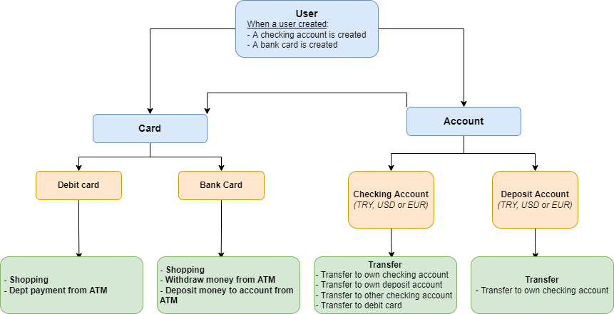
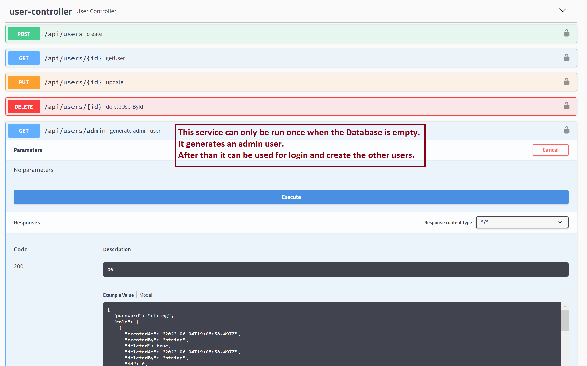
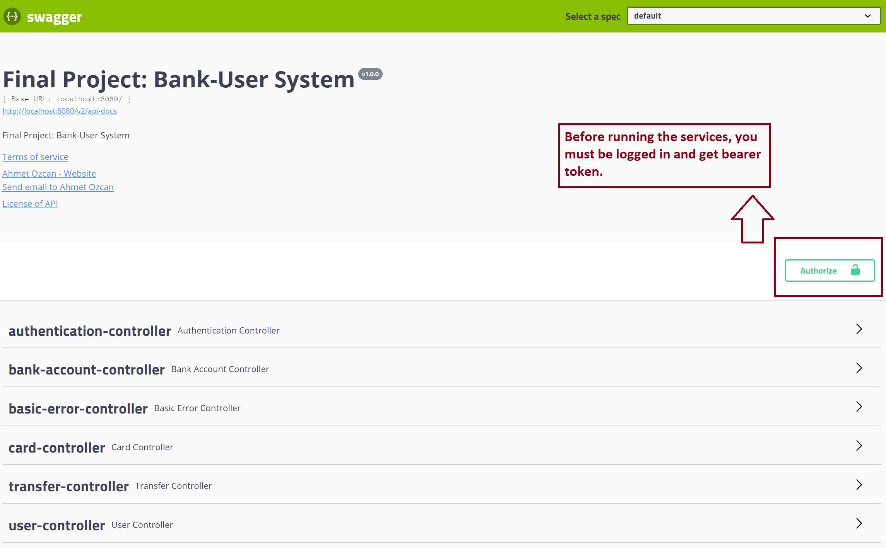
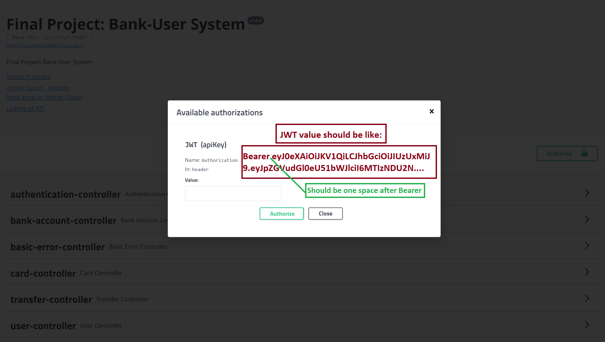
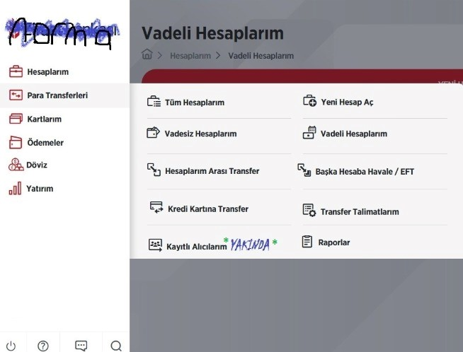

# Norma Spring Boot Final Project

### NOTE: Firstly, should be generated Admin user

An admin user is required to run the application. The address http://localhost:8080/api/users/admin should be used to
create the admin user. The explanation is below for swagger:

Admin user:

Identity: 10000000000

Password: Norm@.1

Also, all endpoint postman collections are in postman folder.
## Project design



## Run

clone the project below url

```bash
  git clone https://github.com/172-Norma-Java-Spring-Bootcamp/final-project-aozcann.git
```

maven clean install

```bash
  maven clean install
```

run the project

```bash
  docker-compose up
```

Swagger url:

```
http://localhost:8080/swagger-ui.html
```

## Admin generate



This url for genarated admin:

```
http://localhost:8080/swagger-ui.html#/user-controller/generateAdminUserUsingGET
```

## Authorize



## Authorization with bearer token



Token example :Bearer eyJ0eXAiOiJKV1QiLCJhbGciOiJIUzUxMiJ9.eyJpZGVudGl0eU51bWJlciI6M
TIzNDU2Nzg5MTIsImV4cCI6MTY1NDM3NDMzMiwiaWF0IjoxNjU0MzcyNTMyLCJ1c2VySWQiOjMyfQ.FcMMbC2UOn_4XcjUBIFdVcZFG-jaEP91OpAyAg5rdKDu0gD1xC0JH7Plwr4LhQfYTDS0HpIHh60ylTzJN6YE3w

### What app can do now

Sorry about my front-end skill. I tried tp show what my app do.



Bu bitirme projesi kapsamında bootcamp katılımcılarının bir online bankacılık sisteminin backend servislerini yazmaları
beklenmektedir. Proje kapsamında beklenen minimum fonksiyonlar ve teknik ihtiyaçlar aşağıda listelenmiştir.

Bitirme projesi bireysel olarak implemente edilecek birbiriyle aynı olan projeler başarısız sayılacaktır. Bunun yanında
yardımlaşma, fikir alışverişi herzamanki gibi desteklenmektedir :)

## Beklenen fonksiyonlar

* Müşteri yönetimi
* Hesap yönetimi
* Kart yönetimi
* Transfer yönetimi

### Müşteri yönetimi

Yaratılacak API'lar aracılığıyla; müşteri yaratma, güncelleme ve silme işlemleri mümkün olacaktır. Silme işlemi
hesaplarında parası bulunan yada kredi kartı borcu bulunan müşteriler için mümkün olmayacak.

### Hesap yönetimi

Banka müşterilerinin yatırımlarını kontrol etmek amacıyla kullanabilmeleri için hesap yaratmalarına, silmelerine API'lar
aracılığıyla izin verilecektir. Kullanıcılar iki farkılı türde hesap açabilecek, vadesiz mevduat hesabı ve birikim
hesabı. İki hesap arası para transferi yapılabilecek, vadesiz mevduat hesabı başka hesaplara para transferi için
kullanılabilecekken birikim hesabından doğrudan para transferi yapılamayacak. Hesaplar TL, Euro yada Dolar para
birimlerinde açılabilecek.

### Kart yönetimi

Müşterilere banka tarafından bankamatiklerde yada alışverişte kullanılmak üzere ön ödemeli banka kartı ve kredi kartları
sunulmaktadır. Bu kartların yaratılması, müşteri ve hesapla ilişkilendirilmesi, kart kullanarak para transferi (
alışveriş)
fonksiyonları API'lar aracılığıyla sağlanacaktır.

Ayrıca kredi kartları için; borç sorgulama, hesaptan borç ödeme, bankamatikten borç ödeme, ekstre görüntüleme (JSON
formatında)
işlemleri yine API aracılığı ile yapılabilecek.

### Transfer yönetimi

Müşterilerin para transferlerini yönetmek için uygun API'lar sağlanmalıdır. Bir müşteri farklı para birimlerinde açılan
hesaplar arası transfer yapmak isterse güncel para kuru https://api.exchangeratesapi.io/latest?base=TRY API'dan alınmalı
ve dönüşüm yapılıp transfer öyle gerçekleştirilemeli. Transfer işlemleri sadece IBAN üzerinden gerçekleştirilebilecek.

## Teknik beklentiler

Yukarda belirtilen tüm operasyonlar tamamı Java ve Spring Boot kullanılarak implemente edilecektir, proje genelinde
bootcamp boyunca öğrendiğimiz OOP prensipleri doğru şekilde uygulanmalıdır.

Tüm fonksiyonlar REST API'lar aracılığı ile yerine getirilmeli ve API'lar swagger arayüzü ile dökümantasyonu
yapılmalıdır. Hata durumları uygun şekilde ele alınmalı ve hatalara uygun responselar üretilmeli.

Uygulama genelinde Spring Boot, Spring Rest ve JPA kullanılmalı, clean code ve SOLID prensiplerine uyulmalı, unit
testler eklenmelidir.


